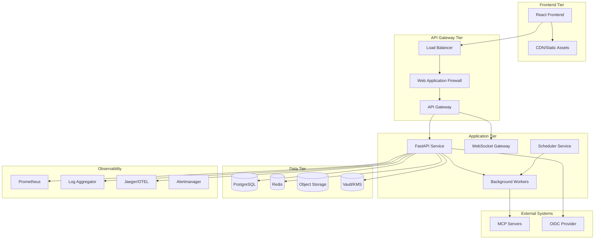
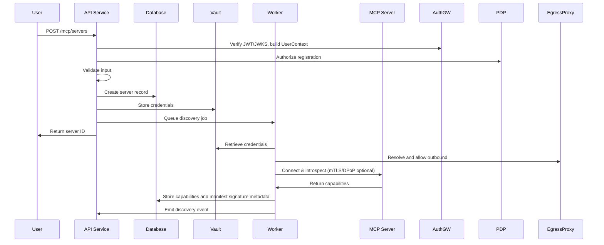
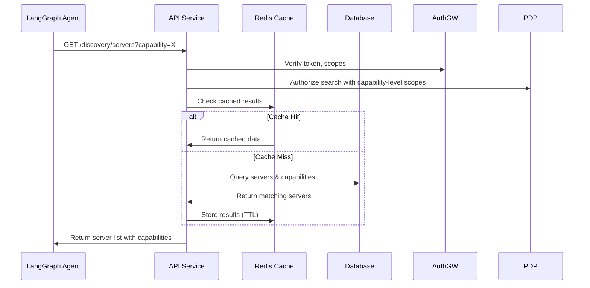
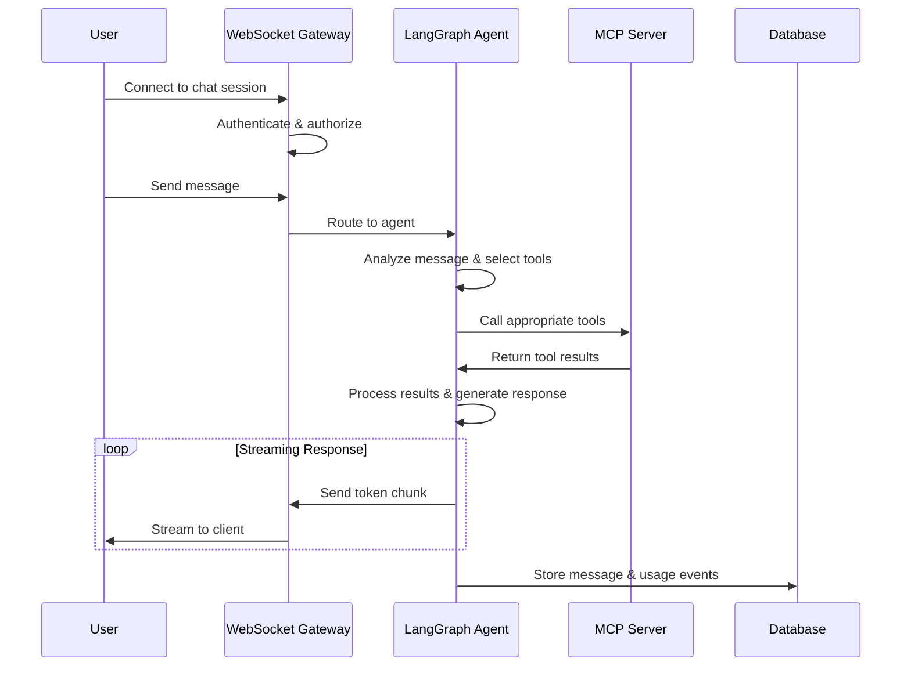
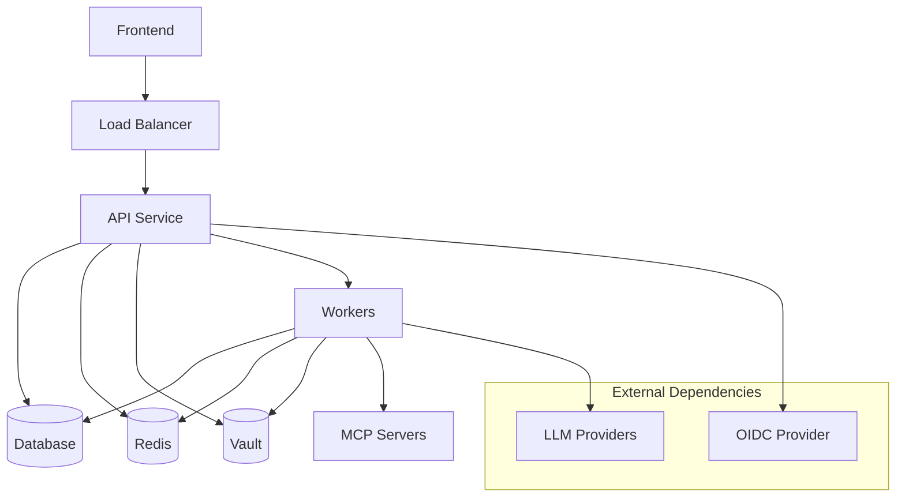

# SprintConnect Architecture

## System Overview

SprintConnect is designed as a cloud-native, microservices-based platform for MCP (Model Context Protocol) server discovery, management, and testing. The architecture emphasizes scalability, security, observability, and maintainability while providing enterprise-grade features for multi-tenant environments.

## SprintConnect Ecosystem (Component Map)

This section enumerates the explicit parts of the SprintConnect solution and how they fit together.

- Frontend UI (React): Administrative console, discovery explorer, chat testing console
- API Service (FastAPI): Core REST APIs (registry, discovery, capabilities, health, metrics)
- WebSocket Gateway: Real-time chat streaming and event updates
- AuthGateway: Centralized authentication and request-context middleware (JWT/JWKS, PKCE, DPoP/mTLS)
- Policy Decision Point (PDP): Externalized authorization (OPA/Cedar) for per-capability policy checks
- Discovery Workers: Asynchronous capability discovery and manifest verification
- Health Workers: Periodic health probing, trend analysis, and alerts
- External Agents (e.g., LangGraph): Outside the platform; connect via OAuth 2.1/DPoP/mTLS to call MCP tools through SprintConnect
- Tenant-Aware Egress Proxy: Secure outbound connectivity with DNS pinning and allowlists
- Registry Database (PostgreSQL): Organizations, users, servers, capabilities, manifests, audits
- Cache/Queues (Redis): Caching and background job queues
- Secrets Management (Vault/KMS): Storage and rotation for credentials and keys
- Observability Stack: Prometheus, Jaeger/OTEL, centralized logs, alerting
- CI/CD & IaC: GitHub Actions, Helm/Kubernetes, security scanning

These components together form the SprintConnect platform and are referenced consistently across Security, API, and Operations documents.

## Core Principles

### Agentic Design
- **LLM-Driven Orchestration**: All decision-making leverages AI intelligence rather than hardcoded business logic
- **Self-Learning**: System adapts to different MCP server implementations and usage patterns
- **Dynamic Tool Selection**: LangGraph agents intelligently route tool calls based on capabilities and context
- **No Server-Specific Hardcoding**: Generic, capability-based approach for maximum flexibility

### Cloud-Native Architecture
- **Horizontally Scalable**: Stateless services that scale independently based on demand
- **Container-First**: All services packaged as containers with immutable deployments
- **Event-Driven**: Asynchronous processing with event streaming for loose coupling
- **Resilient**: Circuit breakers, retries, and graceful degradation patterns

### Security-by-Default
- **Zero Trust**: No implicit trust between services or users
- **Least Privilege**: Minimal permissions granted by default with explicit escalation
- **Defense in Depth**: Multiple security layers including network, application, and data
- **Comprehensive Auditability**: Immutable audit trails for all actions and decisions

## High-Level Components



## Service Architecture

### Frontend Layer

#### React Application
- **Technology**: React 18 + TypeScript + Vite
- **State Management**: Zustand/Redux with React Query for server state
- **Authentication**: OIDC with PKCE flow, API key fallback
- **Real-time**: WebSocket for chat streaming, SSE for notifications
- **Deployment**: Static hosting with CDN distribution

**Key Responsibilities:**
- User interface for MCP server management
- Discovery search and capability browsing
- Multi-server chat testing console
- Analytics dashboards and reporting
- Administration and user management

### API Gateway Tier

#### Load Balancer
- **Technology**: NGINX, HAProxy, or cloud load balancer
- **Features**: SSL termination, request routing, health checks
- **Scaling**: Auto-scaling based on request volume and latency

#### API Gateway
- **Technology**: Kong, Envoy, or cloud API gateway
- **Features**: Rate limiting, authentication, request/response transformation
- **Security**: API key validation, JWT verification, IP allowlisting

#### Web Application Firewall (WAF)
- **Technology**: ModSecurity, cloud WAF, or Cloudflare
- **Protection**: SQL injection, XSS, DDoS mitigation
- **Monitoring**: Attack pattern detection and alerting

### Application Tier

#### FastAPI Service
- **Technology**: Python 3.11+ with FastAPI and Pydantic v2
- **Database**: SQLAlchemy 2.x with PostgreSQL
- **Caching**: Redis for session and application caching
- **Security**: OIDC integration, RBAC, input validation

**Core Endpoints:**
- Authentication and authorization
- MCP server registry CRUD operations
- Discovery API for LangGraph agents
- Chat session management
- Metrics and analytics APIs
- Administration and audit endpoints

#### WebSocket Gateway
- **Technology**: FastAPI WebSocket or separate Socket.IO service
- **Features**: Real-time chat streaming, connection management
- **Scaling**: Sticky sessions or Redis pub/sub for multi-instance
- **Security**: Token-based authentication, rate limiting

#### Background Workers
- **Technology**: Celery with Redis broker or RQ
- **Task Types**: 
  - MCP server capability discovery
  - Health check monitoring
  - Chat tool execution
  - Data export and archival
  - Maintenance and cleanup jobs

**Worker Pools:**
- **Discovery Workers**: CPU-intensive capability introspection
- **Health Workers**: I/O-bound health check requests
- **Chat Workers**: LLM and MCP server tool calls
- **Maintenance Workers**: Data cleanup and archival tasks

#### Scheduler Service
- **Technology**: Celery Beat or separate cron service
- **Functions**: Periodic health checks, credential rotation, cleanup
- **Configuration**: Environment-specific schedules and policies

#### External Agents
Note: This ecosystem does not integrate with external agent runtimes or LLM providers. SprintConnect's scope is MCP management only.

#### AuthGateway (New)
- Purpose: Centralized authentication and request context gateway for all API and WS traffic.
- Responsibilities:
  - Verify JWT via JWKS (issuer/audience/alg allowlist), cache keys, enforce TTL/clock skew.
  - Enforce OAuth 2.1 defaults (PKCE, exact redirect_uri matching, no implicit flow).
  - Optional token binding (DPoP) or mTLS for server-to-server.
  - Extract and propagate `UserContext` and `ServiceContext` (org_id, roles, scopes, policy_version, request_id).
  - Uniform problem+json error responses for authN failures.

#### Policy Decision Point (PDP) (New)
- Externalized authorization using OPA/Cedar (sidecar or service):
  - Inputs: subject (user, roles, scopes), resource (server, capability), action, context (org, env, risk).
  - Outputs: allow/deny with obligation (e.g., redaction, rate-limit class).
  - Versioned policies per tenant; emits decision audit with policy version hash.

#### Eventing and Outbox (New)
- All long-running actions (discovery, health probing, cleanup) are queued.
- Outbox pattern on DB writes to publish domain events reliably:
  - `server.registered`, `server.discovery.started`, `server.discovery.completed`, `server.health.changed`.
- Idempotency keys on jobs; retry with backoff; dead-letter queues with alerts.

#### Tenant-aware Egress Proxy (New)
- All outbound HTTP(S)/WS(S) to MCP servers and LLM providers is routed through a controlled egress proxy that enforces:
  - DNS pinning and re-resolution checks.
  - Private address and link-local blocks, port deny-lists.
  - Per-tenant allowlists and rate limits.

#### MCP Specification Trust (New)
- Capability manifests must be JWS-signed by trusted issuers.
- On registration:
  - Verify signature (issuer, kid, alg), check trust roots per tenant.
  - Persist signature metadata and computed policy hash.
  - Version manifest and enable rollback to last good version.

### Data Tier

#### PostgreSQL Database
- **Version**: PostgreSQL 14+ with logical replication
- **Features**: ACID compliance, JSON support, full-text search
- **Scaling**: Read replicas for analytics, connection pooling
- **Backup**: Point-in-time recovery, cross-region replication

**Key Tables:**
- Organizations and users (multi-tenancy)
- MCP servers and capabilities
- Capability manifest versions (signature, issuer, kid, policy_hash, status)
- Chat sessions and messages
- Usage events and metrics
- Audit logs and webhooks
- Policies and permissions

#### Redis Cache/Queue
- **Version**: Redis 6+ with clustering support
- **Uses**: Session storage, application cache, message queues
- **Configuration**: Separate instances for cache vs. queues
- **Persistence**: RDB snapshots with AOF for durability

#### Object Storage
- **Technology**: S3-compatible storage (AWS S3, MinIO, GCS)
- **Contents**: Chat exports, discovery results, backups
- **Structure**: Organized by organization and timestamp
- **Lifecycle**: Automated retention and archival policies

#### Secrets Management
- **Technology**: HashiCorp Vault or cloud KMS (AWS/GCP/Azure)
- **Contents**: MCP server credentials, API keys, encryption keys
- **Access**: Service authentication with scoped policies
- **Rotation**: Automated credential rotation schedules

## Data Flow Patterns

### MCP Server Registration Flow



### Discovery API Flow



### Chat Session Flow



## Security Architecture

### Authentication & Authorization

#### Identity Providers
- **Primary**: OIDC/OAuth2 with PKCE for web applications
- **Secondary**: API keys for service-to-service communication
- **MFA**: Integration with enterprise MFA providers
- **SSO**: Support for enterprise identity providers (SAML, LDAP)

#### Role- and Scope-Based Access Control (RBAC + OAuth Scopes)
```yaml
# Example RBAC structure
roles:
  admin:
    permissions:
      - "org:*"
      - "mcp:*"
      - "users:*"
      - "audit:read"
  
  engineer:
    permissions:
      - "mcp:servers:read"
      - "mcp:servers:create"
      - "mcp:servers:update"
      - "mcp:capabilities:read"
      - "chat:sessions:*"
      - "metrics:read"
  
  viewer:
    permissions:
      - "mcp:servers:read"
      - "mcp:capabilities:read"
      - "chat:sessions:read"
      - "metrics:read"
```

#### Policy Engine
- **Technology**: Open Policy Agent (OPA) or custom policy engine
- **Policies**: Fine-grained access control for MCP servers and capabilities
- **Evaluation**: Real-time policy evaluation for API requests
- **Versioning**: Policy versioning and rollback capabilities

### Network Security

#### Network Segmentation
- **Frontend**: Public subnet with CDN and load balancer
- **API Gateway**: DMZ subnet with limited ingress/egress
- **Application**: Private subnet with no direct internet access
- **Database**: Isolated subnet with strict access controls

#### TLS/mTLS Configuration
```yaml
# TLS configuration
tls:
  min_version: "1.2"
  cipher_suites:
    - "TLS_ECDHE_RSA_WITH_AES_256_GCM_SHA384"
    - "TLS_ECDHE_RSA_WITH_AES_128_GCM_SHA256"
  
# mTLS for MCP server connections (optional)
mtls:
  client_cert_auth: true
  ca_bundle: "/path/to/ca-bundle.pem"
  cert_rotation: "30d"
```

#### Egress Controls
- **Allowlist**: Approved MCP server endpoints and LLM providers
- **Proxy**: Outbound requests through authenticated proxy
- **Monitoring**: Log and alert on unusual egress patterns
- **SSRF Protection**: URL validation and network isolation

### Application Security

#### Input Validation
```python
# Example Pydantic validation
class McpServerCreate(BaseModel):
    name: str = Field(..., min_length=1, max_length=100, regex=r'^[a-zA-Z0-9\-_]+$')
    base_url: HttpUrl = Field(..., description="MCP server HTTP endpoint")
    environment: Environment = Field(..., description="Deployment environment")
    tags: List[str] = Field(default=[], max_items=20)
    
    @validator('base_url')
    def validate_url(cls, v):
        # Additional URL validation logic
        if not is_allowed_host(v.host):
            raise ValueError("Host not in allowlist")
        return v
```

#### CSRF Protection
- **SameSite Cookies**: Strict SameSite policy for session cookies
- **CSRF Tokens**: Include tokens in state-changing requests
- **Origin Validation**: Verify Origin and Referer headers
- **Double Submit**: Cookie and header token validation

#### Rate Limiting
```yaml
# Rate limiting configuration
rate_limits:
  global:
    requests_per_second: 100
    burst: 200
  
  per_organization:
    requests_per_minute: 1000
    requests_per_day: 100000
  
  per_user:
    requests_per_minute: 60
    chat_sessions_per_hour: 10
  
  per_api_key:
    requests_per_minute: 500
    concurrent_requests: 50
```

### Data Protection

#### Encryption at Rest
- **Database**: Transparent data encryption (TDE) with rotating keys
- **Object Storage**: Server-side encryption with customer-managed keys
- **Secrets**: Vault encryption with envelope encryption pattern
- **Backups**: Encrypted backups with separate key management

#### Encryption in Transit
- **Client-Server**: TLS 1.2+ with perfect forward secrecy
- **Service-Service**: mTLS or encrypted service mesh
- **Database**: Encrypted connections with certificate validation
- **Message Queues**: TLS for Redis and Kafka connections

#### Data Classification
```yaml
# Data classification levels
classification:
  public:
    - server_names
    - capability_names
    - public_metadata
  
  internal:
    - usage_metrics
    - health_status
    - chat_messages
  
  confidential:
    - user_pii
    - api_keys
    - audit_logs
  
  restricted:
    - mcp_credentials
    - encryption_keys
    - security_logs
```

### Multi-tenant Isolation (Enhanced)
- DB query scoping by `org_id` enforced in repositories.
- Cache key namespacing per tenant; deny cross-tenant reads.
- Storage paths partitioned by tenant; egress policies per tenant+environment.

## Scalability & Performance

### Horizontal Scaling

#### Stateless Design
- **API Services**: No server-side state, scale based on CPU/memory
- **Worker Services**: Independent task processing, scale based on queue depth
- **WebSocket Gateways**: Session affinity or Redis pub/sub for multi-instance

#### Auto-scaling Policies
```yaml
# Kubernetes HPA configuration
autoscaling:
  api_service:
    min_replicas: 3
    max_replicas: 50
    target_cpu: 70%
    target_memory: 80%
  
  worker_service:
    min_replicas: 2
    max_replicas: 20
    target_queue_depth: 100
    scale_up_delay: 30s
    scale_down_delay: 300s
```

#### Database Scaling
- **Read Replicas**: Separate read and write workloads
- **Connection Pooling**: PgBouncer or similar for connection management
- **Query Optimization**: Proper indexing and query analysis
- **Partitioning**: Time-based partitioning for large tables

### Caching Strategy

#### Multi-Level Caching
```python
# Caching hierarchy
class CachingStrategy:
    def __init__(self):
        self.l1_cache = LocalMemoryCache(size="100MB", ttl=60)      # In-memory
        self.l2_cache = RedisCache(ttl=300)                        # Redis
        self.l3_cache = DatabaseCache(ttl=3600)                    # DB views
    
    async def get_servers(self, filters):
        # Check L1 cache first
        if result := await self.l1_cache.get(cache_key):
            return result
        
        # Check L2 cache
        if result := await self.l2_cache.get(cache_key):
            await self.l1_cache.set(cache_key, result)
            return result
        
        # Query database and populate caches
        result = await self.database.query(filters)
        await self.l2_cache.set(cache_key, result)
        await self.l1_cache.set(cache_key, result)
        return result
```

#### Cache Invalidation
- **Time-based**: TTL for eventual consistency
- **Event-based**: Invalidate on data changes
- **Manual**: Admin controls for cache clearing
- **Warming**: Pre-populate frequently accessed data

### Performance Optimization

#### Database Optimization
```sql
-- Example indexes for common queries
CREATE INDEX CONCURRENTLY idx_mcp_servers_org_env 
ON mcp_servers(org_id, environment) 
WHERE status = 'active';

CREATE INDEX CONCURRENTLY idx_mcp_capabilities_search 
ON mcp_capabilities USING GIN(to_tsvector('english', name || ' ' || description));

CREATE INDEX CONCURRENTLY idx_usage_events_time_series 
ON mcp_usage_events(org_id, created_at) 
WHERE created_at >= CURRENT_DATE - INTERVAL '90 days';
```

#### API Optimization
- **Pagination**: Cursor-based pagination for large result sets
- **Field Selection**: GraphQL-style field selection for REST APIs
- **Compression**: Gzip/Brotli compression for response payloads
- **HTTP/2**: Server push for related resources

## Observability & Monitoring

### Metrics Collection

#### Application Metrics
```python
# Prometheus metrics examples
REQUEST_COUNT = Counter(
    'http_requests_total',
    'Total HTTP requests',
    ['method', 'endpoint', 'status']
)

REQUEST_DURATION = Histogram(
    'http_request_duration_seconds',
    'HTTP request duration',
    ['method', 'endpoint']
)

ACTIVE_CHAT_SESSIONS = Gauge(
    'active_chat_sessions',
    'Number of active chat sessions',
    ['org_id']
)

MCP_SERVER_HEALTH = Gauge(
    'mcp_server_health_status',
    'MCP server health status',
    ['server_id', 'environment']
)
```

#### Business Metrics
- **Server Registration Rate**: New servers per day/week
- **Discovery API Usage**: Queries per LangGraph agent
- **Chat Session Metrics**: Duration, tool calls, token usage
- **User Engagement**: Active users, session frequency
- **Cost Attribution**: Token costs per organization/user

### Distributed Tracing

#### OpenTelemetry Integration
```python
# Tracing configuration
from opentelemetry import trace
from opentelemetry.exporter.jaeger.thrift import JaegerExporter
from opentelemetry.instrumentation.fastapi import FastAPIInstrumentor

# Initialize tracing
tracer = trace.get_tracer(__name__)

@tracer.start_as_current_span("discover_capabilities")
async def discover_capabilities(server_id: str):
    span = trace.get_current_span()
    span.set_attribute("server.id", server_id)
    
    try:
        capabilities = await introspect_server(server_id)
        span.set_attribute("capabilities.count", len(capabilities))
        return capabilities
    except Exception as e:
        span.record_exception(e)
        span.set_status(trace.Status(trace.StatusCode.ERROR, str(e)))
        raise
```

#### Trace Correlation
- Include PDP decision spans (policy input hash, policy version, decision time).
- Include egress proxy spans with target, DNS resolution, and policy outcome.

- **Request IDs**: Unique identifiers across service calls
- **User Context**: User/organization context in traces
- **Error Correlation**: Link errors to specific traces
- **Performance Analysis**: Identify bottlenecks in distributed calls

### Logging Strategy

#### Structured Logging
```python
# Structured logging configuration
import structlog

logger = structlog.get_logger()

# Log example
await logger.ainfo(
    "mcp_server_registered",
    server_id=server.id,
    org_id=server.org_id,
    environment=server.environment,
    capabilities_count=len(capabilities),
    user_id=current_user.id,
    request_id=request_id
)
```

#### Log Aggregation
- **Centralized**: ELK stack, Splunk, or cloud logging
- **Correlation**: Request ID linking across services
- **Alerting**: Real-time alerts on error patterns
- **Retention**: Configurable retention per log level

### Alerting & Incident Response

#### Alert Definitions
```yaml
# Example Prometheus alerting rules
groups:
  - name: sprintconnect.rules
    rules:
      - alert: HighErrorRate
        expr: rate(http_requests_total{status=~"5.."}[5m]) > 0.01
        for: 2m
        labels:
          severity: warning
        annotations:
          summary: "High error rate detected"
      
      - alert: DatabaseConnectionExhaustion
        expr: pg_stat_activity_count > 80
        for: 1m
        labels:
          severity: critical
        annotations:
          summary: "Database connection pool nearly exhausted"
      
      - alert: MCPServerDown
        expr: mcp_server_health_status == 0
        for: 5m
        labels:
          severity: warning
        annotations:
          summary: "MCP server {{ $labels.server_id }} is unhealthy"
```

#### Incident Response
- **On-Call Rotation**: 24/7 coverage for critical alerts
- **Escalation Policies**: Automatic escalation after timeout
- **Runbooks**: Documented procedures for common issues
- **Post-Incident Review**: Blameless post-mortems and improvements

## Disaster Recovery & Business Continuity

### Backup Strategy

#### Data Backup
```yaml
# Backup configuration
backups:
  database:
    full_backup: daily
    incremental_backup: hourly
    retention: 30_days
    encryption: aes_256
    
  object_storage:
    cross_region_replication: true
    versioning: enabled
    lifecycle_policy: 90_days
    
  secrets:
    vault_backup: daily
    key_rotation: 90_days
    recovery_keys: 5
```

#### Recovery Procedures
- **RTO**: Recovery Time Objective of 4 hours
- **RPO**: Recovery Point Objective of 15 minutes
- **Testing**: Monthly disaster recovery drills
- **Documentation**: Step-by-step recovery procedures

### High Availability

#### Multi-Region Deployment
- **Active-Active**: Load balancing across regions
- **Data Replication**: Asynchronous database replication
- **Failover**: Automatic failover for region outages
- **Consistency**: Eventual consistency with conflict resolution

#### Service Dependencies


## Future Architecture Considerations

### Microservices Evolution
- **Service Decomposition**: Split monolithic API into focused services
- **Service Mesh**: Istio or Linkerd for service-to-service communication
- **Event Sourcing**: Consider event sourcing for audit trails
- **CQRS**: Command Query Responsibility Segregation for read/write optimization

### Advanced Analytics
- **Data Lake**: Raw data storage for advanced analytics
- **ML Pipeline**: Machine learning for usage prediction and optimization
- **Real-time Analytics**: Stream processing for live dashboards
- **AI Insights**: LLM-powered insights and recommendations

### Edge Computing
- **Edge Deployment**: Deploy components closer to users/MCP servers
- **CDN Integration**: Advanced caching and content delivery
- **Regional Compliance**: Data residency and sovereignty requirements
- **Latency Optimization**: Reduce round-trip times for critical operations
